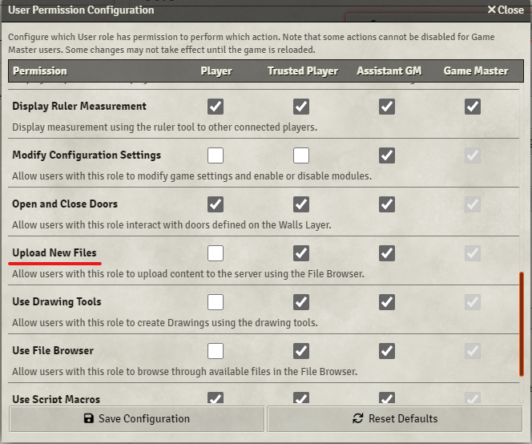

# Chat Images
### Version 3.3 is the last update I will make to this module as I don't play on VTTs anymore.

Known issues in v13
- There is no support for the chat-notification
- The upload button has been removed

---

The title says it all, this module adds support for images in the chat: copy-paste, drag & drop, and links are automatically converted to images.

# Example

# Converting an url into an image
This is different from the previous versions, you will have to wrap your url in `!ci|!`, e.g. `!ci|<url>!`.

# Prerequisites
`Upload New Files` permission, if a user doesn't have it, they will get an warning every time they try to upload an image

